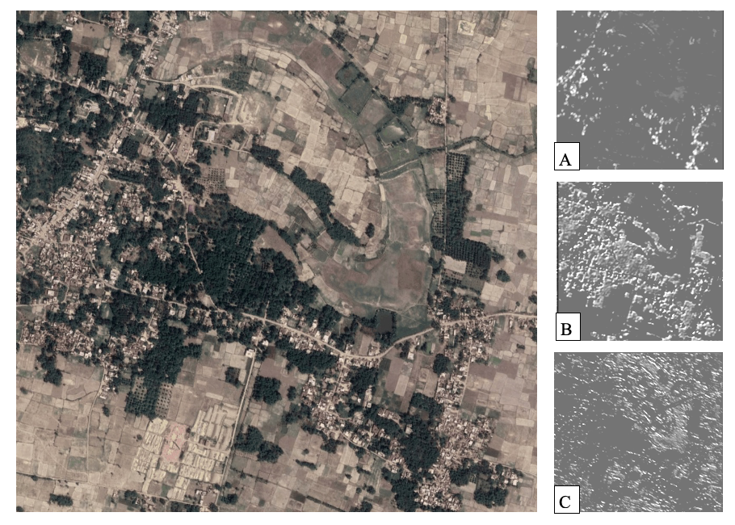
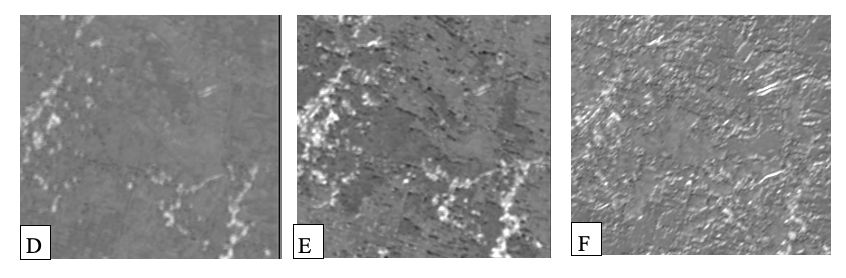

<b><a href="#introduction">Introduction</a></b>
|
<b><a href="#data-structure">Data Structure</a></b>
|
<b><a href="#sample-images">Sample Filter Images</a></b>

<a href="https://github.com/tamjacobs/satimage">

	

</a> 

###  Investigating the transferability of CNN models for income predictions
#### Introduction

This repository is based on the paper <a href="https://www.aaai.org/ocs/index.php/AAAI/AAAI18/paper/view/16441" target="_blank">"Multi-Task Deep Learning for Predicting Poverty From Satellite Images"</a> (AAAI Conference on Innovative Applications of Artificial Intelligence: IAAI 2018). It has been modified for a UNSW Honours Thesis investigating the transferability of CNN models applied to different locations for developmental predictions. The region_info documents for every district in Bihar have been added to investigate the possibility of transfering the CNN model to a new unseen state. Further, the developmental and income predictions have been included as well. The repository also contains the code and model weights for two prediction tasks:

1. Predict, using a multi-task fully convolutional deep neural network (<a href="models/developmental/model.png" target="_blank">PNG</a>, <a href="models/developmental/best_model_architecture.json" target="_blank">JSON</a>, <a href="https://www.dropbox.com/s/187e6zp2or2s9ni/best_model_weights.h5?dl=0" target="_blank">Weights</a>), three developmental parameters -- the main material of the roof, source of lighting and source of drinking water -- from satellite imagery.

	Following are the categories for each of the three tasks in the multi-task model. The multi-task model outputs 24 values (9 for roof type, 6 for source of lighting and 9 for source of drinking water) as three probability distributions, one distribution per task.

	| # | Roof Type        			| Lighting Source           		| Drinking Water Source   	|
	| - | --------------------------------- | ------------------------------------- | ----------------------------- |
	| 1 | Grass/thatch/bamboo/wood/mud      | Electricity 				| Treated tap-water 		|
	| 2 | Plastic/polythene      		| Kerosene 				| Untreated tap-water 		|
	| 3 | Hand made tiles      		| Solar energy 				| Covered well 			|
	| 4 | Machine made tiles      		| Other oil 				| Uncovered well 		|
	| 5 | Burnt brick      			| Any other 				| Handpump	 		|
	| 6 | Stone/slate      			| No lighting 				| Tubewell/borehole 		|
	| 7 | G.I./metal/asbestos      		| 	 				| River/canal	 		|
	| 8 | Concrete      			| 	 				| Tank/pond/lake 		|
	| 9 | Any other material      		| 	 				| Other source	 		|
	

2. Predict, using a simple four-layer fully-connected neural network (<a href="models/income_poverty_pd/model.png" target="_blank">PNG</a>, <a href="models/income_poverty_pd/best_model_architecture.json" target="_blank">JSON</a>, <a href="https://www.dropbox.com/s/ml3hkms3nlx0k0u/best_model_weights.h5?dl=0" target="_blank">Weights</a>), the income levels (a direct indicator of poverty) using the predicted developmental parameter outputs of the first (multi-task) model -- model P.D., trained on predicted data.

3. Predict, using a simple four-layer fully-connected neural network (<a href="models/income_poverty_cd/model.png" target="_blank">PNG</a>, <a href="models/income_poverty_cd/best_model_architecture.json" target="_blank">JSON</a>, <a href="https://www.dropbox.com/s/jk6xhloa6946y9s/best_model_weights.h5?dl=0" target="_blank">Weights</a>), the income levels using the actual developmental parameter values -- model C.D., trained on census data.

#### Data Structure

| File/folder             |	Content           |	Source |
| --------------------------------- | ------------------------------------- | ----------------------------- |
Village_info.csv |	List of villages within a sub-district with the coordinates of each |	2011 Indian Census,   Google Maps Geocoding API|
|Images|	Collection of 1920x1920 satellite images of all the villages listed in village_info.csv | Google Maps Static API |
|Developmental_ data.csv | Ground truth data on the roof material, source of lighting and source of water for each village |	2011 Indian Census |
|Data_subdistrict _income .csv |	Ground truth data for the proportion of households in each income class grouped by sub-district |	Socio-Economic Caste Census of 2011 |
|<District_name>	| Folder containing Images folder, Developmental_data.csv, data_subdistrict_ income.csv and village_info.csv | - |

#### Sample filter responses

	

</a> 

The above image shows a sample satellite image with corresponding features extracted from Layer 13

	

</a> 

The above image shows a sample satellite image with corresponding features extracted from Layers 14 (D), 15 (E), 16 (F)